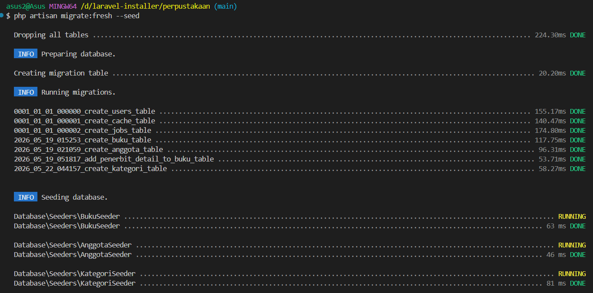
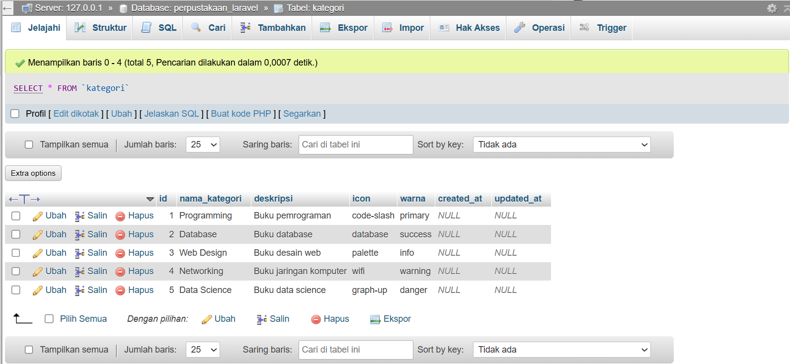
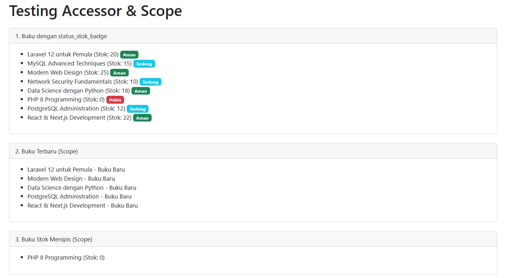
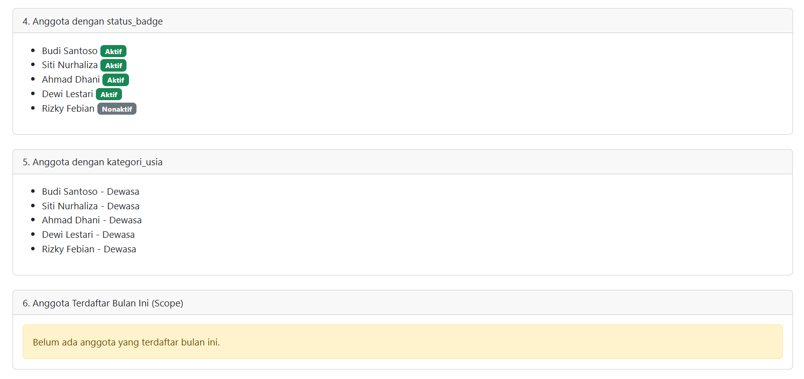

# Database-Dengan-Migration-Model
Pengelolaan database menggunakan Laravel Migration dan Eloquent ORM. Migration memungkinkan version control untuk struktur database, sedangkan Eloquent menyediakan cara elegan untuk berinteraksi dengan database menggunakan konsep OOP.

## Tugas Pertemuan 10

- Nama: Bima Adi Nugroho
- NIM : 60324077

---

## Hasil Migration dan Seeder

---

## Hasil Database Setelah Migration

---

## Hasil Testing Route

